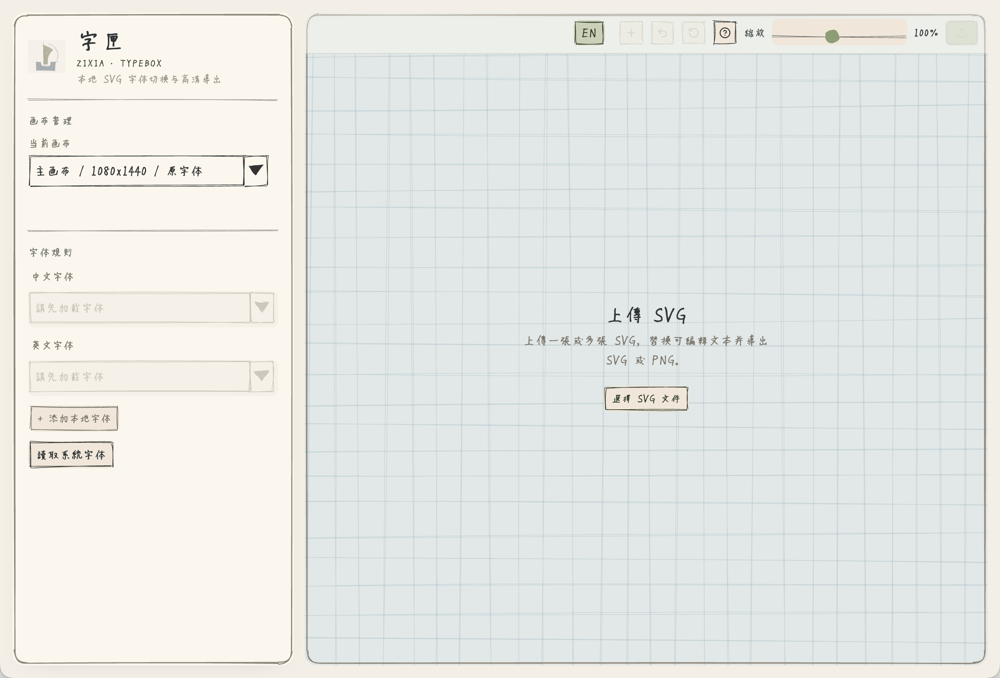

<div align="center">
  
  <br />
  <a href="https://geode-play.github.io/zixia-typecase/">
    
  </a>
  <p>导入包含可编辑文字的 SVG，快速切换字体、微调文字，并导出高清 PNG 或可继续编辑的 SVG。</p>
</div>

<p align="center">
  
</p>

## 它能做什么

- 导入一张或多张 SVG。
- 为中文/CJK 与英文/Latin 分别设置字体。
- 读取系统字体，或上传 TTF、OTF、WOFF、WOFF2 字体文件。
- 点击文字节点后微调内容、字体和字号。
- 调整画布尺寸、背景和导出倍率。
- 导出当前图卡，或批量导出全部图卡。

## 使用方式

### 在线使用

[打开在线版](https://geode-play.github.io/zixia-typecase/)。无需安装，SVG 和字体文件会优先在浏览器本地处理，不需要上传到服务器。

### 下载桌面版

也可以下载桌面版使用：

| 平台 | 文件 |
| --- | --- |
| macOS | [ZIXIA-0.1.0-mac.dmg](https://github.com/Geode-play/zixia-typecase/releases/download/v0.1.0/ZIXIA-0.1.0-mac.dmg) |
| Windows 安装版 | [ZIXIA-0.1.0-win.exe](https://github.com/Geode-play/zixia-typecase/releases/download/v0.1.0/ZIXIA-0.1.0-win.exe) |
| Windows 绿色版 | [ZIXIA-0.1.0-win-portable.zip](https://github.com/Geode-play/zixia-typecase/releases/download/v0.1.0/ZIXIA-0.1.0-win-portable.zip) |

目前桌面安装包可能尚未签名或公证，因此系统可能会出现安全提醒：

- macOS 提示“无法验证开发者”时，可以在 Finder 中右键 App，选择“打开”；也可以到“系统设置 → 隐私与安全性”中选择“仍要打开”。
- Windows 出现 Microsoft Defender SmartScreen 提醒时，可以选择“更多信息 → 仍要运行”。如果系统或安全软件拦截，请确认安装包来自本项目的 GitHub Releases。

这些提示通常只需要手动允许一次，不需要重启电脑。

### 本地开发运行

```bash
npm install
npm run dev
```

## 补充说明

- 系统字体读取功能依赖 Local Font Access API，目前主要由 Chromium 系浏览器支持；如果浏览器不支持该 API，仍然可以通过上传本地字体文件使用。
- 系统字体只保存字体 family 名称，不会默认把字体文件嵌入导出的 SVG。使用系统字体导出的 PNG 会按本机渲染结果生成；导出的 SVG 在其他电脑上打开时，如果对方没有同名字体，显示效果可能不同。

## 反馈与支持

遇到问题或有想法，欢迎到 [GitHub Issues](https://github.com/Geode-play/zixia-typecase/issues) 里聊。

<p align="center">
  
  <br />
  <span>Buy me a coffee</span>
</p>

## 素材与授权

Logo 是为这个项目生成的 AI 图片。

当前仓库内置的 UI 字体为：

- `src/assets/fonts/tekitou-poem.ttf`：`TekitouPoem / 適当ポエム`，版权方为 `Cockatrice Digital`。

根据该字体官方 BOOTH 页面说明，`TekitouPoem / 適当ポエム` 以 SIL Open Font License 1.1 发布，可商用，使用时不需要署名。由于本仓库会再分发字体文件本身，已在 [src/assets/fonts/OFL-1.1.txt](./src/assets/fonts/OFL-1.1.txt) 附上 OFL 1.1 许可证文本。若修改或再分发字体文件，需要继续遵守 OFL 条件。

## 许可证

项目代码使用 [AGPL-3.0](./LICENSE)。

内置字体使用 [SIL Open Font License 1.1](./src/assets/fonts/OFL-1.1.txt)。
